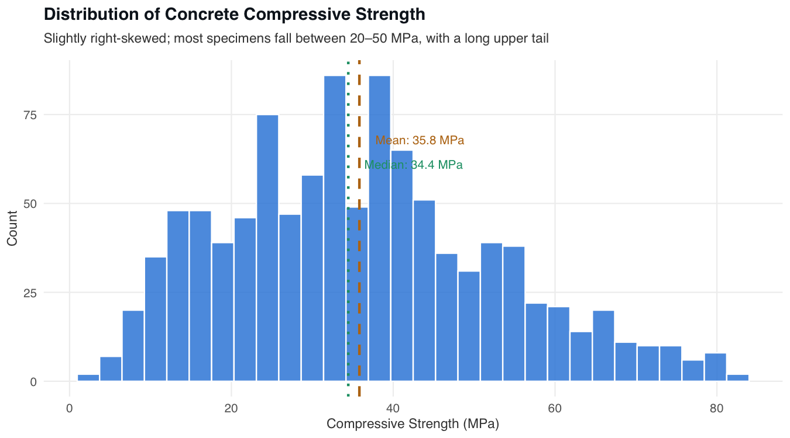
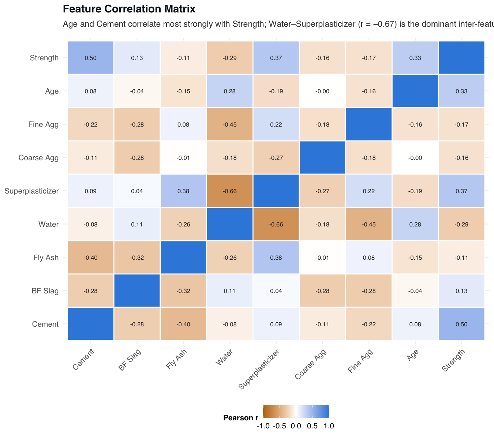
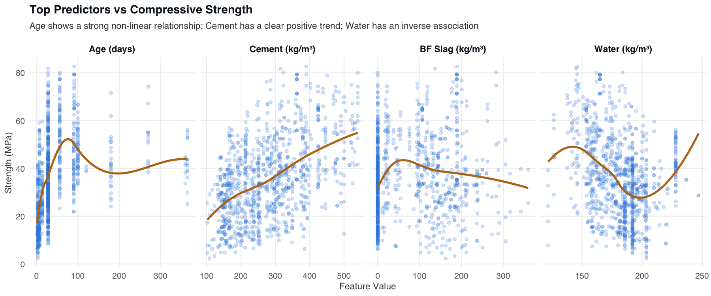
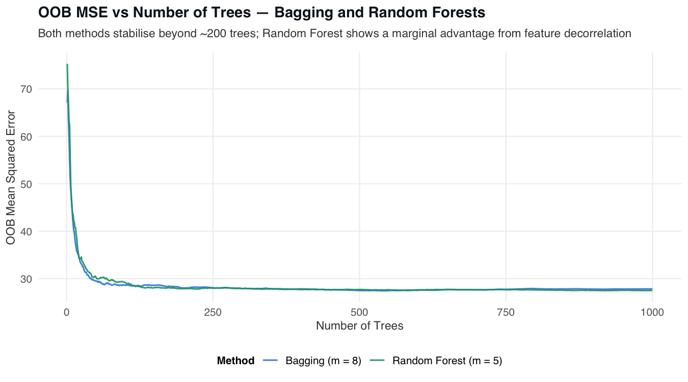
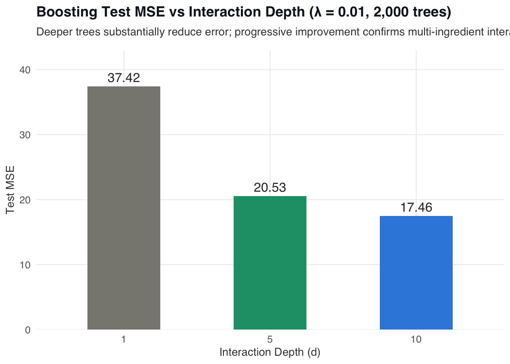
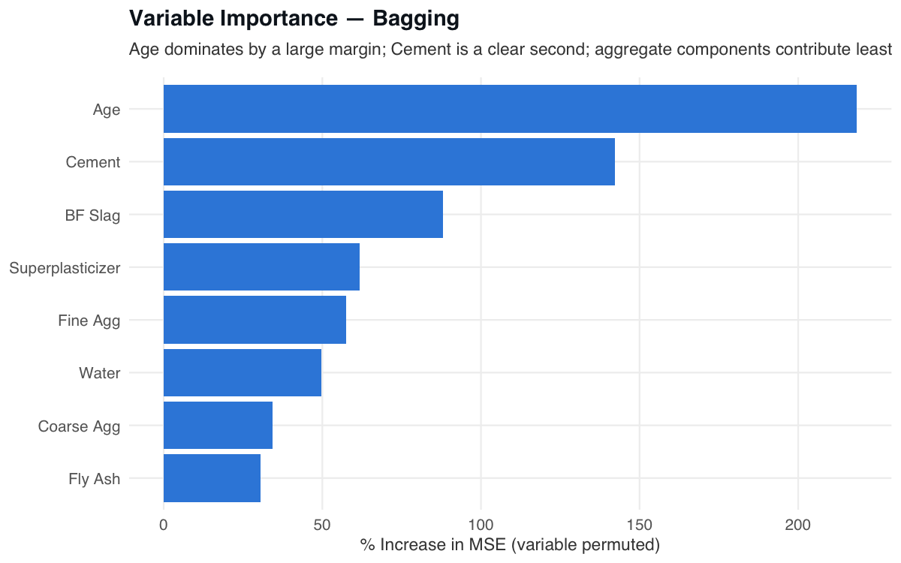
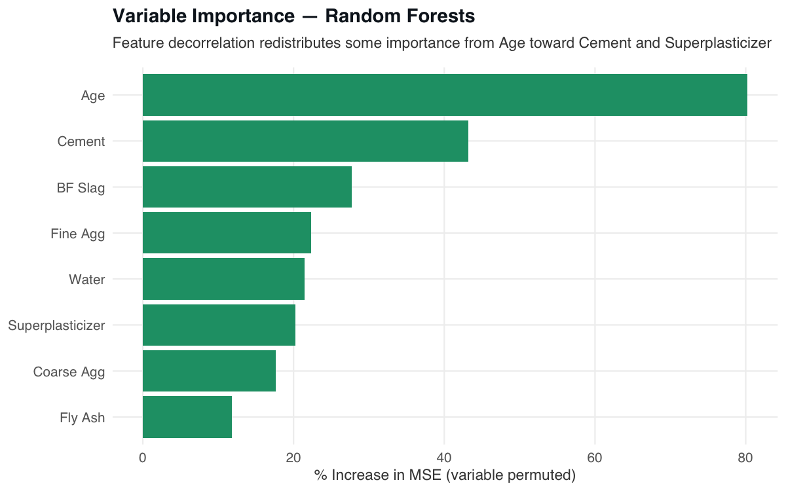
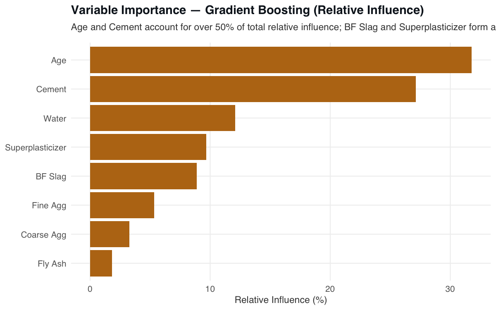

# 📌 Material Property Prediction

> Benchmarks Bagging, Random Forests, and Gradient Boosting on 1,030 concrete specimens to predict compressive strength in MPa from mix-design ingredients and curing age.

## 📖 Overview
 - Implements three tree ensemble methods — Bagging, Random Forests, and Gradient Boosting — to predict concrete compressive strength (MPa) on the UCI Concrete Compressive Strength dataset (1,030 specimens, 8 mix-design predictors, regression task).
 - Benchmarks averaging-based ensembles (Bagging, Random Forests) against sequential residual-fitting (Gradient Boosting) to isolate the contribution of bias reduction versus variance reduction.
 - Built as a self-contained R Markdown report with a custom `theme_portfolio()` styling and `set.seed(42)` throughout for full reproducibility.
 - Gradient Boosting required interaction depth d = 10 because concrete strength is governed by joint ingredient interactions — cement content, water-cement ratio, and curing age act jointly, not additively.

## 🏢 Business Impact
Laboratory determination of concrete compressive strength requires cured physical specimens and specialized testing equipment, making rapid strength estimates during early structural design impractical and expensive. A model that predicts strength directly from mix proportions and curing age reduces the number of physical tests required, accelerates design iteration, and supports mix optimization before production-scale batching. The 38% MSE reduction achieved by Gradient Boosting over Bagging demonstrates that capturing multi-ingredient interaction effects — rather than averaging independent trees — is the approach better aligned with the nonlinear chemistry of cementitious systems.

## 🚀 Features
✅ **Three-Method Benchmark:** Compares Bagging, Random Forests, and Gradient Boosting under identical 70/30 train-test conditions, isolating the contribution of decorrelation and sequential residual-fitting to prediction accuracy.  
✅ **Interaction Depth Analysis:** Evaluates Gradient Boosting at d ∈ {1, 5, 10} to confirm that compressive strength involves genuine higher-order ingredient interactions, not just additive single-feature effects.  
✅ **OOB MSE Convergence Curves:** Tracks Out-of-Bag error as a function of tree count for Bagging and Random Forests, identifying the minimal tree budget for stable performance.  
✅ **Variable Importance Across All Three Methods:** Reports %IncMSE (Bagging, Random Forests) and relative influence (Boosting) for all 8 predictors, cross-validating rankings against established concrete engineering theory.  
✅ **Reproducible R Markdown Report:** Full analysis — EDA, modelling, diagnostics, and figures — rendered from a single `analysis.Rmd` with all outputs committed to `figures/` and `results/`.  

## ⚙️ Tech Stack
| Technology                  | Purpose                                                                  |
| --------------------------- | ------------------------------------------------------------------------ |
| `R`                         | Primary analysis and modelling language                                  |
| `R Markdown`                | Reproducible literate programming report rendered to HTML                |
| `randomForest`              | Bagging and Random Forest models with OOB error tracking and variable importance |
| `gbm`                       | Gradient Boosting Machine with configurable shrinkage and interaction depth |
| `ggplot2`                   | All eight figures with custom `theme_portfolio()` styling                |
| `tidyr`                     | Data reshaping for the faceted predictor-vs-strength scatter panel       |

## 📂 Project Structure
<pre>
📦 Material Property Prediction
 ┣ 📂 data
 ┃ ┗ 📂 raw
 ┃   ┣ 📜 Concrete_Data.csv
 ┃   ┗ 📜 README.md
 ┣ 📂 figures
 ┃ ┣ 📜 01_strength-distribution.png
 ┃ ┣ 📜 02_correlation-heatmap.png
 ┃ ┣ 📜 03_predictors-vs-strength.png
 ┃ ┣ 📜 04_oob-mse-vs-trees.png
 ┃ ┣ 📜 05_boosting-depth-comparison.png
 ┃ ┣ 📜 06_feature-importance-bagging.png
 ┃ ┣ 📜 07_feature-importance-rf.png
 ┃ ┗ 📜 08_feature-importance-boosting.png
 ┣ 📂 results
 ┃ ┗ 📜 metrics.md
 ┣ 📜 analysis.Rmd
 ┣ 📜 LICENSE
 ┗ 📜 README.md
</pre>

> **Why are all figures pre-rendered and committed?** Tree ensemble methods with 5,000 trees and `cache=TRUE` chunks take several minutes to run. Committing the rendered PNGs means the report can be viewed and navigated without re-running the full analysis.

## 🛠️ Installation

1️⃣ **Clone the repository**
<pre>
git clone https://github.com/real-ahmed-moussa/mpp.git
cd mpp
</pre>

2️⃣ **Install R dependencies**
<pre>
install.packages(c("randomForest", "gbm", "ggplot2", "tidyr", "rmarkdown"))
</pre>

3️⃣ **Render the report**
<pre>
rmarkdown::render("analysis.Rmd")
</pre>

The rendered HTML report and all figures in `figures/` will be generated in the project root.

## 📂 Analysis Figures
### Compressive Strength Distribution

  

### Feature Correlation Matrix

  

### Top Predictors vs Compressive Strength

  

### OOB MSE Convergence — Bagging vs Random Forests

  

### Boosting Test MSE vs Interaction Depth

  

### Variable Importance — Bagging

  

### Variable Importance — Random Forests

  

### Variable Importance — Gradient Boosting

  

## 📊 Results
 - **Task:** Regression — predicting concrete compressive strength (MPa) from 8 mix-design predictors on 1,030 UCI specimens with a 70/30 train-test split.
 - **Best model:** Gradient Boosting (λ = 0.01, d = 10, 5,000 trees) achieved a test MSE of **17.14**, a **38% reduction** from the Bagging baseline of 27.57.
 - **Bagging vs Random Forests:** Near-identical MSE (27.57 vs 27.78) — Age is so dominant that feature decorrelation provides limited benefit since Age appears in nearly every split regardless of m.
 - **Interaction depth effect:** Progressive improvement from d = 1 (MSE 29.02) → d = 5 (18.53) → d = 10 (17.14) confirms that compressive strength involves genuine multi-ingredient interactions.
 - **Variable importance:** Age and Cement rank first and second across all three methods, consistent with concrete engineering theory; aggregate components contribute least.

## 📝 License
This project is shared for portfolio purposes only and may not be used for commercial purposes without permission.
